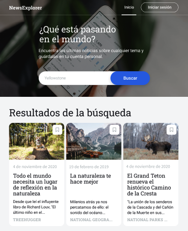

# NewsExplorer 📰

NewsExplorer es una aplicación web moderna desarrollada con React que permite a los usuarios buscar y guardar artículos de noticias de interés. La aplicación consume la API de NewsAPI para obtener noticias actualizadas sobre cualquier tema.



## 🚀 Características

- **Búsqueda de noticias:** Busca noticias sobre cualquier tema utilizando la API de NewsAPI
- **Autenticación de usuarios:** Sistema de registro e inicio de sesión
- **Guardar artículos:** Guarda tus artículos favoritos para leerlos más tarde
- **Gestión de guardados:** Visualiza y elimina artículos guardados
- **Diseño responsivo:** Interfaz adaptable a diferentes dispositivos
- **Persistencia de datos:** Los artículos y sesión se guardan en localStorage
- **Interfaz intuitiva:** Navegación fluida entre páginas

## 🛠️ Tecnologías Utilizadas


- **React** (v18+) - Biblioteca de JavaScript para construir interfaces de usuario
- **React Router DOM** - Enrutamiento y navegación
- **NewsAPI** - API para obtener noticias
- **CSS3** - Estilos y diseño responsivo
- **Vite** - Herramienta de construcción y desarrollo
- **LocalStorage** - Persistencia de datos en el navegador

## 📋 Requisitos Previos

- Node.js (v14 o superior)
- npm o yarn
- Una API Key de [NewsAPI](https://newsapi.org/)

## 🔧 Instalación

1. **Clona el repositorio:**
```bash
git clone https://github.com/luuzuriaga/news-explorer-frontend.git
cd news-explorer-frontend
```

2. **Instala las dependencias:**
```bash
npm install
```

3. **Configura tu API Key:**

Edita el archivo `src/utils/NewsApi.js` y reemplaza la API_KEY con tu propia clave:
```javascript
const API_KEY = 'TU_API_KEY_AQUI';
```

4. **Inicia el servidor de desarrollo:**
```bash
npm run dev
```

5. **Abre tu navegador en:**
```
http://localhost:5173
```

## 📁 Estructura del Proyecto

```
newsexplorer/
├── src/
│   ├── assets/
│   │   └── images/          # Imágenes e íconos
│   ├── components/
│   │   ├── About/           # Sección sobre el autor
│   │   ├── App/             # Componente principal
│   │   ├── Footer/          # Pie de página
│   │   ├── Header/          # Encabezado y navegación
│   │   ├── LoginModal/      # Modal de inicio de sesión
│   │   ├── Main/            # Página principal
│   │   ├── Navigation/      # Menú de navegación
│   │   ├── NewsCard/        # Tarjeta de artículo
│   │   ├── NewsCardList/    # Lista de artículos
│   │   ├── Preloader/       # Indicador de carga
│   │   ├── RegisterModal/   # Modal de registro
│   │   ├── SavedNews/       # Página de guardados
│   │   ├── SavedNewsHeader/ # Encabezado de guardados
│   │   ├── SearchForm/      # Formulario de búsqueda
│   │   └── SuccessModal/    # Modal de éxito
│   ├── contexts/
│   │   └── CurrentUserContext.js  # Contexto de usuario
│   ├── utils/
│   │   └── NewsApi.js       # Utilidades para la API
│   ├── vendor/
│   │   ├── fonts/           # Fuentes personalizadas
│   │   └── normalize.css    # Reset de estilos
│   ├── index.css            # Estilos globales
│   └── main.jsx             # Punto de entrada
├── index.html
├── package.json
├── vite.config.js
└── README.md
```

## 🎯 Funcionalidades Principales

### 1. Búsqueda de Noticias
- Ingresa cualquier palabra clave en el buscador
- La aplicación busca artículos de los últimos 7 días
- Muestra hasta 100 resultados
- Opción "Ver más" para cargar más artículos

### 2. Sistema de Autenticación
- **Registro:** Crea una cuenta con email, contraseña y nombre
- **Inicio de sesión:** Accede con tus credenciales
- **Persistencia:** La sesión se mantiene al recargar la página
- **Cierre de sesión:** Sal de tu cuenta de forma segura

### 3. Guardar Artículos
- Haz clic en el ícono de bookmark para guardar un artículo
- Los artículos guardados se asocian con palabras clave
- Solo usuarios autenticados pueden guardar artículos
- Los artículos se guardan en localStorage

### 4. Gestión de Guardados
- Visualiza todos tus artículos guardados en `/saved-news`
- Ve estadísticas de tus palabras clave más usadas
- Elimina artículos que ya no te interesen
- Cada artículo muestra su palabra clave asociada

## 🎨 Características de UI/UX

- **Iconos interactivos:**
  - Bookmark gris: Artículo no guardado
  - Bookmark azul: Artículo guardado
  - Ícono de basura: Eliminar de guardados

- **Estados visuales:**
  - Preloader durante la búsqueda
  - Mensajes de error personalizados
  - Tooltips informativos
  - Validación de formularios en tiempo real

- **Diseño responsivo:**
  - Adaptable a móviles, tablets y desktop
  - Menú hamburguesa en dispositivos móviles
  - Grid responsivo para las tarjetas de noticias

## 🔐 Seguridad y Mejores Prácticas

- Validación de formularios en el cliente
- Sanitización de inputs
- Manejo de errores robusto
- No se almacenan contraseñas (simulación de login)

## 📝 Scripts Disponibles

```bash
# Desarrollo
npm run dev          # Inicia el servidor de desarrollo

# Producción
npm run build        # Construye la aplicación para producción
npm run preview      # Vista previa de la versión de producción

# Linting
npm run lint         # Ejecuta ESLint
```

## 🌐 API Utilizada

**NewsAPI** - https://newsapi.org/

Endpoints utilizados:
- `GET /everything` - Buscar noticias por palabra clave

Parámetros principales:
- `q`: Palabra clave de búsqueda
- `from`: Fecha de inicio
- `to`: Fecha final
- `pageSize`: Número de resultados
- `apiKey`: Tu clave de API

## 🚧 Futuras Mejoras

- [ ] Backend real con Node.js/Express
- [ ] Base de datos (MongoDB/PostgreSQL)
- [ ] Autenticación JWT
- [ ] Filtros avanzados de búsqueda
- [ ] Categorías de noticias
- [ ] Sistema de favoritos mejorado
- [ ] Compartir artículos en redes sociales
- [ ] Modo oscuro
- [ ] Notificaciones push
- [ ] PWA (Progressive Web App)

## 🤝 Contribuciones

Las contribuciones son bienvenidas. Por favor:

1. Haz un Fork del proyecto
2. Crea una rama para tu feature (`git checkout -b feature/AmazingFeature`)
3. Commit tus cambios (`git commit -m 'Add some AmazingFeature'`)
4. Push a la rama (`git push origin feature/AmazingFeature`)
5. Abre un Pull Request

## 📄 Licencia

Este proyecto está bajo la Licencia MIT. Ver el archivo `LICENSE` para más detalles.

## 👤 Autor

**Lucero Uzuriaga**

- GitHub: [@luuzuriaga](https://github.com/luuzuriaga)
- LinkedIn: [Lucero Uzuriaga](https://linkedin.com/in/lucerouzuriaga)

## 🙏 Agradecimientos

- [Tripletenn](https://tripleten.com) - Bootcamp de desarrollo web
- [NewsAPI](https://newsapi.org/) - API de noticias
- [React](https://react.dev/) - Framework JavaScript
- [Vite](https://vitejs.dev/) - Build tool

---

⭐️ Si este proyecto te fue útil, considera darle una estrella en GitHub!

**Desarrollado con ❤️ por Lucero Uzuriaga - © 2025**
